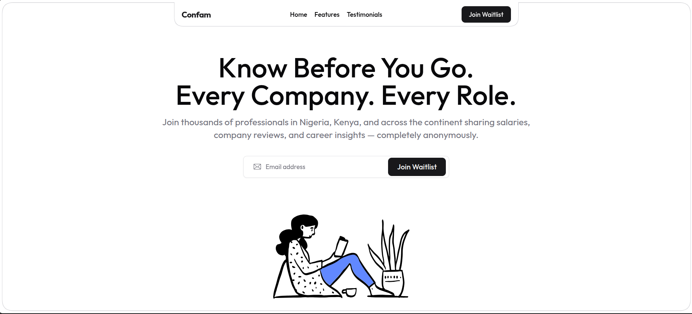

  

# GetConfam MVP

GetConfam is a "Double-Blind" discussion and salary-sharing board, designed to provide transparent, verifiable career insights without compromising user privacy.

This guide outlines the technical architecture and implementation strategy for the MVP.

## 🚀 Tech Stack

- **Framework**: Next.js 14+ (App Router)
- **Backend/Database**: Convex
- **Authentication**: Convex Auth
- **Email/OTP**: Resend (For Magic Links and Work Verification)
- **Styling**: Tailwind CSS + Shadcn UI

## 📖 What the Project is About

GetConfam enables professionals to anonymously share real salaries, discuss industry trends, and see verified insights from top companies. Trust is built through a "Double-Blind" verification system: users can optionally verify their work email (e.g., `paystack.com`), giving their posts an authoritative badge, without ever exposing their true identity or tying their personal email to their posts.

### Trust & Privacy Guardrails

- **The "Salt" Promise**: The salt remains a backend secret.
- **Zero Logs**: Work emails are processed in memory and never logged.
- **Data Minimization**: "We store a digital fingerprint, not your email address."

## 🏗️ Technical Architecture

### Visualized Database Schemas

In Convex, schemas are defined in TypeScript (`convex/schema.ts`). Here is how the tables relate to each other.

#### A. Users Table (`users`)

Managed by Convex Auth, extended with verification fields.

| Field            | Type             | Description                                                 |
| :--------------- | :--------------- | :---------------------------------------------------------- |
| `email`          | string           | Personal email (from login).                                |
| `workEmailHash`  | string (indexed) | SHA-256 (email + salt). Prevents duplicate verification.    |
| `verifiedDomain` | string           | e.g., "paystack.com" or "kuda.com".                         |
| `isVerified`     | boolean          | Global verification status.                                 |
| `aliasSeed`      | string           | Seed used to generate a consistent "Anonymous Animal" name. |

#### B. Salaries Table (`salaries`)

The core data for the "Salary Board."

| Field              | Type             | Description                                         |
| :----------------- | :--------------- | :-------------------------------------------------- |
| `userId`           | id("users")      | Reference to the author.                            |
| `role`             | string           | Job title.                                          |
| `company`          | string           | Display name of the company.                        |
| `amount`           | number           | The raw value entered.                              |
| `period`           | string           | "monthly" or "annual".                              |
| `annualizedAmount` | number (indexed) | Normalized value for platform-wide sorting.         |
| `isVerified`       | boolean          | Snapshot of verification status at time of posting. |

#### C. Posts Table (`posts`)

The "Thread Starter" for the discussion board.

| Field            | Type        | Description                                            |
| :--------------- | :---------- | :----------------------------------------------------- |
| `userId`         | id("users") | The OP (Original Poster).                              |
| `title`          | string      | Catchy headline (e.g., "Oracle layoffs have begun!!"). |
| `content`        | string      | The main body text.                                    |
| `authorAlias`    | string      | e.g., "Anonymous Suya".                                |
| `domain`         | string      | e.g., "oracle.com".                                    |
| `isVerifiedPost` | boolean     | Does this post get the "Confam" badge?                 |
| `createdAt`      | number      | Timestamp.                                             |

#### D. Comments Table (`comments`)

Allows other users to join the conversation.

| Field               | Type        | Description                              |
| :------------------ | :---------- | :--------------------------------------- |
| `postId`            | id("posts") | Relation to the parent thread.           |
| `userId`            | id("users") | The commenter's ID.                      |
| `content`           | string      | The reply text.                          |
| `authorAlias`       | string      | Generated based on commenter's `userId`. |
| `domain`            | string      | Commenter's domain (if verified).        |
| `isVerifiedComment` | boolean     | Does this reply get a badge?             |
| `createdAt`         | number      | Timestamp.                               |

## 🌟 What the MVP is Now

To drive growth while maintaining trust, GetConfam uses a tiered display:

1. **Verified User**:
   - Post/Comment Label: `Anonymous Lion @ Paystack ✅`
   - Authority: High. Data included in company averages.
2. **Unverified User** (Signed up via Gmail):
   - Post/Comment Label: `Anonymous Lion (Unverified)`
   - Authority: Medium/Low. Visible in feed but clearly marked.
3. **Guest** (Not Logged In):
   - Can view "Top Posts" and "Salary Averages" but cannot see specific thread contents or post anything.

## 🤝 Contribution

We welcome community contributions! Since this is an open-source project:

1. Fork the repository.
2. Create your feature branch (`git checkout -b feature/amazing-feature`).
3. Commit your changes (`git commit -m 'Add some amazing feature'`).
4. Push to the branch (`git push origin feature/amazing-feature`).
5. Open a Pull Request.

Please make sure to follow the existing code style and test your changes locally.
